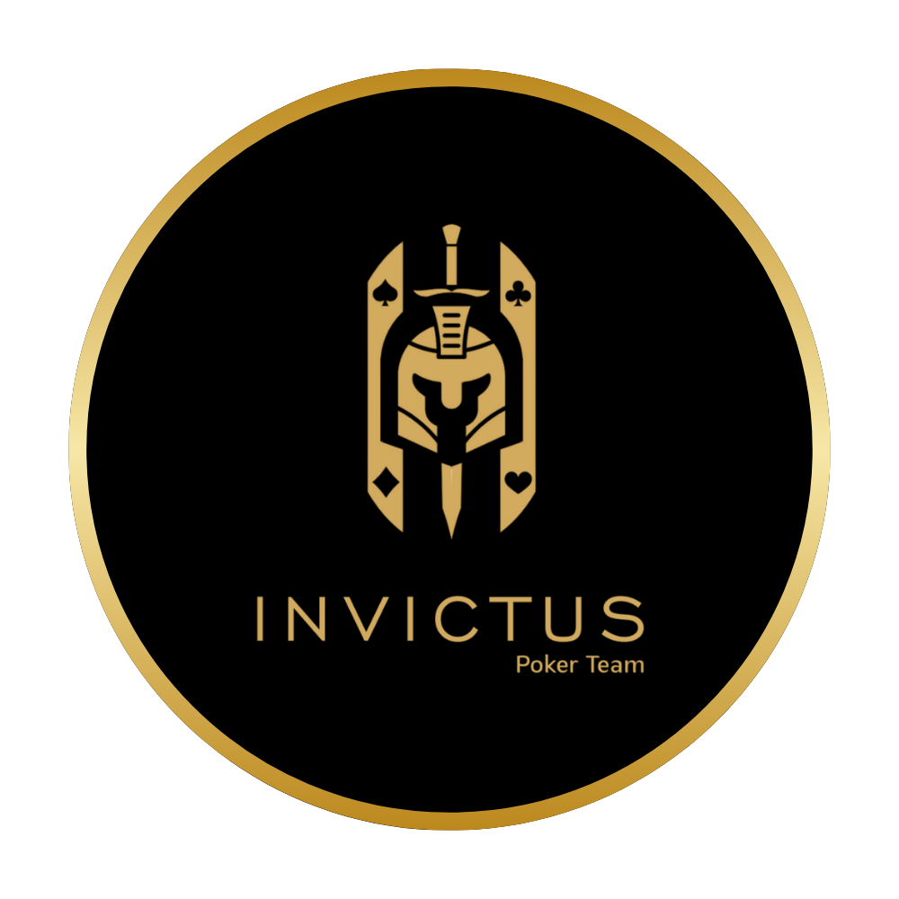

# 🎯 Sistema Invictus Poker Team

<div align="center">
  
  
  [](https://github.com/Kaiojen/invictus-poker-team)
  [](https://www.python.org/)
  [](https://reactjs.org/)
  [](LICENSE)
</div>

## 🌟 Visão Geral

O **Sistema Invictus Poker Team** é uma aplicação web completa e moderna desenvolvida para gerenciar equipes de poker profissionais. O sistema oferece controle total sobre jogadores, contas em múltiplas plataformas, transações financeiras, solicitações de reload e relatórios analíticos avançados.

Desenvolvido com foco na **experiência do usuário** e **segurança**, o sistema apresenta uma identidade visual elegante em **preto e dourado**, refletindo a sofisticação e profissionalismo do time Invictus Poker Team.

### 💰 Sistema Monetário
Todas as transações e valores são gerenciados em **dólares americanos (USD)**, proporcionando padronização internacional para operações de poker online.

## Características Principais

### Identidade Visual

- **Tema**: Preto e dourado (tons ouro metálico)
- **Layout**: Minimalista, moderno e elegante
- **Tipografia**: Montserrat (limpa e sofisticada)
- **Elementos visuais**: Ícones com bordas arredondadas e detalhes dourados
- **Sistema de cores para status**:
  - 🟢 Verde: Status completo/OK
  - 🟡 Amarelo/Ouro: Avisos e pendências
  - 🔴 Vermelho: Alertas graves e críticos

## 🚀 Funcionalidades Principais

### 👥 **Gestão Completa de Usuários**
- **Sistema de Autenticação Seguro**: Login/logout com sessões protegidas
- **Controle de Acesso Multi-nível**: 
  - 🔴 **Admin**: Controle total do sistema
  - 🟡 **Manager**: Gestão de jogadores e aprovações
  - 🟢 **Player**: Acesso aos próprios dados e solicitações
  - 🔵 **Viewer**: Visualização limitada de relatórios
- **Perfis Personalizados**: Dados completos dos jogadores
- **Sistema de Notificações**: Alertas automáticos para pendências
- **Gestão de Senhas**: Alteração segura com criptografia

### 🎰 **Gestão de Plataformas de Poker**
- **Cadastro de Plataformas**: PokerStars, GGPoker, PartyPoker, 888poker, etc.
- **Múltiplas Contas por Jogador**: Controle individualizado por plataforma
- **Monitoramento de Saldos**: Acompanhamento em tempo real ($USD)
- **Histórico Financeiro**: Registro completo de movimentações
- **Status das Contas**: Ativo, Inativo, Banido, Em Análise

### 💳 **Sistema Avançado de Reload**
- **Solicitações Inteligentes**: Interface intuitiva para jogadores
- **Fluxo de Aprovação**: Sistema hierárquico de autorizações
- **Histórico Detalhado**: Rastreamento completo de todas as solicitações
- **Notificações Automáticas**: Alertas em tempo real para gestores
- **Relatórios de Reload**: Análises de frequência e valores

### 📊 **Dashboard Analítico**

#### Para Gestores (Admin/Manager):
- **Visão Geral Financeira**: Total em caixa, pendências, lucros
- **Estatísticas de Jogadores**: Performance individual e coletiva
- **Alertas de Sistema**: Contas com problemas, reloads pendentes
- **Relatórios Executivos**: Gráficos de performance e tendências
- **Gestão de Usuários**: Controle completo de acessos

#### Para Jogadores (Player):
- **Bankroll Pessoal**: Saldo atual em todas as plataformas
- **Histórico de Transações**: Movimentações financeiras detalhadas
- **Status de Solicitações**: Acompanhamento de reloads
- **Performance Pessoal**: Gráficos de evolução financeira
- **Notificações**: Alertas personalizados

### 🔔 **Sistema de Notificações**
- **Notificações em Tempo Real**: WebSocket para atualizações instantâneas
- **Central de Notificações**: Hub centralizado de mensagens
- **Alertas Personalizados**: Configuração por tipo de usuário
- **Histórico de Notificações**: Registro completo de comunicações

### 📈 **Relatórios e Analytics**
- **Relatórios Financeiros**: Balanços, P&L, fluxo de caixa
- **Análise de Performance**: Estatísticas individuais e de equipe
- **Relatórios de Auditoria**: Logs de atividades e alterações
- **Exportação de Dados**: PDF, Excel, CSV
- **Gráficos Interativos**: Visualizações avançadas com Chart.js

### 🛡️ **Segurança e Auditoria**
- **Log de Atividades**: Registro completo de ações do sistema
- **Backup Automático**: Proteção de dados com versionamento
- **Controle de Sessões**: Gerenciamento seguro de logins
- **Validação de Dados**: Proteção contra ataques e inconsistências
- **Compliance**: Conformidade com regulamentações de poker online

### 📱 **Interface Responsiva**
- **Design Mobile-First**: Otimizado para dispositivos móveis
- **PWA Ready**: Funcionalidades de aplicativo nativo
- **Tema Dark/Light**: Alternância entre temas (foco no dark dourado)
- **Acessibilidade**: Conformidade com padrões WCAG
- **Performance**: Carregamento otimizado e cache inteligente

## 🏗️ Tecnologias Utilizadas

### **Backend Stack**
```bash
🐍 Python 3.11+           # Linguagem principal
🌶️ Flask 3.1.1            # Framework web minimalista e poderoso
🗄️ SQLAlchemy 2.0.41      # ORM para banco de dados
🔐 Werkzeug Security      # Criptografia de senhas
📊 SQLite + WAL Mode      # Banco de dados otimizado
🔄 Flask-CORS             # Habilitação de Cross-Origin Requests
📧 SMTP Integration       # Sistema de email
🔔 Server-Sent Events     # Notificações em tempo real
```

### **Frontend Stack**
```bash
⚛️ React 18.2.0           # Biblioteca de interface de usuário
⚡ Vite 5.0               # Build tool e dev server ultra-rápido
🎨 Tailwind CSS 3.4       # Framework CSS utility-first
🎯 shadcn/ui              # Componentes UI modernos e acessíveis
🔗 Lucide React           # Ícones vetoriais elegantes
📱 Mobile-First Design    # Responsividade prioritária
🎭 React Hooks            # Gerenciamento de estado local
📊 Chart.js               # Gráficos interativos
🔔 WebSocket Client       # Comunicação em tempo real
```

### **Ferramentas de Desenvolvimento**
```bash
📦 pnpm                   # Gerenciador de pacotes eficiente
🔧 ESLint + Prettier      # Linting e formatação de código
🧪 Jest + Testing Library # Framework de testes
🔄 Git + GitHub           # Controle de versão
📝 JSDoc + TypeScript     # Documentação e tipagem
🐳 Docker Ready           # Containerização preparada
```

## 🏛️ Arquitetura do Sistema

### **Backend Architecture (Flask)**
```
📁 backend/src/
├── 🎯 main.py                 # Aplicação principal e configuração
├── 📊 models/                 # Modelos de dados SQLAlchemy
│   ├── models.py             # Entidades principais do sistema
│   ├── user.py               # Modelo de usuário
│   ├── notifications.py      # Sistema de notificações
│   └── messages.py           # Sistema de mensagens
├── 🛣️ routes/                 # Endpoints da API REST
│   ├── auth.py               # Autenticação e autorização
│   ├── users.py              # Gestão de usuários
│   ├── platforms.py          # Gestão de plataformas
│   ├── accounts.py           # Contas dos jogadores
│   ├── reload_requests.py    # Sistema de reload
│   ├── transactions.py       # Transações financeiras
│   ├── dashboard.py          # Dados dos dashboards
│   ├── reports.py            # Relatórios e analytics
│   ├── notifications.py     # API de notificações
│   ├── backup.py             # Sistema de backup
│   └── audit.py              # Logs de auditoria
├── 🔧 utils/                  # Utilitários e serviços
│   ├── init_data.py          # Dados iniciais do sistema
│   ├── backup_manager.py     # Gerenciamento de backups
│   ├── notification_service.py # Serviço de notificações
│   └── report_generator.py   # Gerador de relatórios
├── 🛡️ middleware/             # Middlewares personalizados
│   └── audit_middleware.py   # Auditoria de requisições
└── 💾 database/              # Banco de dados e backups
    ├── app.db                # Banco SQLite principal
    └── backups/              # Backups automáticos
```

### **Frontend Architecture (React)**
```
📁 frontend/src/
├── 🚀 main.jsx               # Ponto de entrada da aplicação
├── 📱 App.jsx                # Componente raiz e roteamento
├── 🎨 App.css                # Estilos personalizados globais
├── 🧩 components/            # Componentes React organizados
│   ├── 🔐 LoginForm.jsx      # Formulário de autenticação
│   ├── 📊 Dashboard.jsx      # Dashboard principal
│   ├── 👥 PlayerManagement.jsx # Gestão de jogadores
│   ├── 🎰 PlatformAccountsView.jsx # Visualização de contas
│   ├── 💳 ReloadRequestModal.jsx # Modal de solicitação
│   ├── 📈 ReportManagement.jsx # Gestão de relatórios
│   ├── 🔔 NotificationCenter.jsx # Central de notificações
│   ├── 📋 Planilha.jsx       # Sistema de planilhas
│   ├── 🏦 RetaDashboard.jsx  # Dashboard de retas
│   ├── 🛡️ AuditoriaEnhanced.jsx # Sistema de auditoria
│   └── ui/                   # Componentes UI reutilizáveis
│       ├── button.jsx        # Botões personalizados
│       ├── card.jsx          # Cards de conteúdo
│       ├── table.jsx         # Tabelas de dados
│       ├── form.jsx          # Formulários
│       ├── chart.jsx         # Componentes de gráfico
│       └── [+40 componentes] # shadcn/ui completo
├── 🎣 hooks/                 # React Hooks customizados
│   ├── useSSE.js             # Hook para Server-Sent Events
│   └── use-mobile.js         # Hook para detecção mobile
└── 🔧 lib/                   # Utilitários e configurações
    └── utils.js              # Funções auxiliares
```

### Estrutura de Dados

#### Modelos Principais

1. **User**: Usuários do sistema com diferentes roles
2. **Platform**: Plataformas de poker disponíveis
3. **Account**: Contas dos jogadores nas plataformas
4. **ReloadRequest**: Solicitações de reload
5. **Transaction**: Histórico de transações financeiras
6. **PlayerData**: Dados específicos dos jogadores

## 🛠️ Instalação e Configuração

### **Pré-requisitos**
```bash
🐍 Python 3.11+              # Linguagem backend
📦 Node.js 20+               # Runtime JavaScript  
⚡ pnpm (recomendado)         # Gerenciador de pacotes eficiente
🔧 Git                       # Controle de versão
```

### **📥 Clonagem do Repositório**
```bash
git clone https://github.com/Kaiojen/invictus-poker-team.git
cd invictus-poker-team
```

### **🐍 Configuração do Backend (Flask)**
```bash
# Navegar para o diretório backend
cd backend

# Ativar ambiente virtual (Linux/Mac)
source venv/bin/activate

# Ativar ambiente virtual (Windows)
venv\Scripts\activate

# Instalar dependências
pip install -r requirements.txt

# Inicializar banco de dados
python init_db.py

# Executar servidor de desenvolvimento
python src/main.py
```

**🌐 Backend rodando em:** `http://localhost:5000`

### **⚛️ Configuração do Frontend (React)**
```bash
# Navegar para o diretório frontend
cd frontend

# Instalar dependências
pnpm install

# Executar servidor de desenvolvimento
pnpm run dev --host

# Ou usando npm/yarn
npm install && npm run dev
yarn install && yarn dev
```

**🌐 Frontend rodando em:** `http://localhost:5173`

### **🚀 Execução Completa (Desenvolvimento)**
```bash
# Terminal 1 - Backend
cd backend && source venv/bin/activate && python src/main.py

# Terminal 2 - Frontend  
cd frontend && pnpm run dev --host
```

### **📊 Inicialização dos Dados**
O sistema vem com dados de exemplo pré-configurados:
- Usuários de teste com diferentes permissões
- Plataformas de poker populares
- Dados de demonstração para desenvolvimento

## Usuários Padrão

O sistema vem com usuários pré-configurados para teste:

- **Admin**: `admin` / `admin123`
- **Manager**: `manager` / `manager123`
- **Jogador**: `jogador1` / `jogador123`

## Estrutura de Arquivos

### Backend

```
invictus-poker-backend/
├── src/
│   ├── models/
│   │   └── models.py          # Modelos de dados SQLAlchemy
│   ├── routes/
│   │   ├── auth.py            # Autenticação
│   │   ├── users.py           # Gestão de usuários
│   │   ├── platforms.py       # Gestão de plataformas
│   │   ├── accounts.py        # Gestão de contas
│   │   ├── reload_requests.py # Solicitações de reload
│   │   ├── transactions.py    # Transações
│   │   └── dashboard.py       # Dados do dashboard
│   ├── utils/
│   │   └── init_data.py       # Dados iniciais
│   ├── database/
│   │   └── app.db            # Banco SQLite
│   └── main.py               # Aplicação principal
├── venv/                     # Ambiente virtual Python
└── requirements.txt          # Dependências Python
```

### Frontend

```
invictus-poker-frontend/
├── src/
│   ├── components/
│   │   ├── ui/               # Componentes shadcn/ui
│   │   ├── LoginForm.jsx     # Formulário de login
│   │   └── Dashboard.jsx     # Dashboard principal
│   ├── assets/               # Recursos estáticos
│   ├── App.jsx              # Componente principal
│   ├── App.css              # Estilos personalizados
│   └── main.jsx             # Ponto de entrada
├── public/                   # Arquivos públicos
├── package.json             # Dependências Node.js
└── vite.config.js           # Configuração Vite
```

## API Endpoints

### Autenticação

- `POST /api/auth/login` - Login do usuário
- `POST /api/auth/logout` - Logout do usuário
- `GET /api/auth/me` - Dados do usuário atual
- `POST /api/auth/change-password` - Alterar senha

### Usuários

- `GET /api/users/` - Listar usuários
- `POST /api/users/` - Criar usuário
- `GET /api/users/{id}` - Obter usuário específico
- `PUT /api/users/{id}` - Atualizar usuário
- `DELETE /api/users/{id}` - Desativar usuário

### Plataformas

- `GET /api/platforms/` - Listar plataformas
- `POST /api/platforms/` - Criar plataforma
- `PUT /api/platforms/{id}` - Atualizar plataforma

### Contas

- `GET /api/accounts/` - Listar contas
- `POST /api/accounts/` - Criar conta
- `PUT /api/accounts/{id}` - Atualizar conta

### Solicitações de Reload

- `GET /api/reload-requests/` - Listar solicitações
- `POST /api/reload-requests/` - Criar solicitação
- `POST /api/reload-requests/{id}/approve` - Aprovar solicitação
- `POST /api/reload-requests/{id}/reject` - Rejeitar solicitação

### Dashboard

- `GET /api/dashboard/manager` - Dashboard do gestor
- `GET /api/dashboard/player` - Dashboard do jogador
- `GET /api/dashboard/statistics` - Estatísticas gerais

## Segurança

### Autenticação e Autorização

- Sistema de sessões com cookies seguros
- Controle de acesso baseado em roles
- Validação de permissões em todas as rotas
- Proteção contra CSRF

### Banco de Dados

- Senhas criptografadas com Werkzeug
- Soft delete para preservar integridade
- Constraints de integridade referencial
- Backup automático com WAL mode

## Desenvolvimento

### Padrões de Código

- Backend: PEP 8 (Python)
- Frontend: ESLint + Prettier
- Commits semânticos
- Documentação inline

### Testes

- Testes unitários para modelos
- Testes de integração para APIs
- Testes E2E para fluxos críticos

## Deployment

### Produção

O sistema está preparado para deployment usando:

- Backend: Gunicorn + Nginx
- Frontend: Build estático servido pelo Flask
- Banco: SQLite com backup automático

### Variáveis de Ambiente

```bash
FLASK_ENV=production
SECRET_KEY=sua-chave-secreta-aqui
DATABASE_URL=sqlite:///app.db
```

## Suporte e Manutenção

### Logs

- Logs estruturados em JSON
- Rotação automática de logs
- Monitoramento de erros

### Backup

- Backup automático do banco de dados
- Versionamento de schema
- Procedimentos de restore

## 🔮 Roadmap

### **🚀 Próximas Funcionalidades (v1.1)**
- [ ] Sistema de relatórios avançados com BI
- [ ] Integração com APIs oficiais das plataformas
- [ ] Notificações push para mobile
- [ ] Aplicativo móvel nativo (React Native)
- [ ] Sistema de chat interno em tempo real
- [ ] Dashboard de analytics avançado
- [ ] Sistema de metas e objetivos
- [ ] Integração com bancos e carteiras digitais

### **⚙️ Melhorias Técnicas (v2.0)**
- [ ] Migração para PostgreSQL
- [ ] Cache distribuído com Redis
- [ ] Containerização completa com Docker
- [ ] Pipeline CI/CD com GitHub Actions
- [ ] Monitoramento com Prometheus + Grafana
- [ ] Logs centralizados com ELK Stack
- [ ] Testes automatizados (Unit + E2E)
- [ ] API GraphQL opcional

## 🤝 Contribuição

Contribuições são bem-vindas! Para contribuir com o projeto:

### **📋 Como Contribuir**
1. **Fork** o projeto
2. **Clone** o fork para sua máquina
3. **Crie** uma branch para sua feature (`git checkout -b feature/NovaFuncionalidade`)
4. **Commit** suas mudanças (`git commit -m 'Adiciona Nova Funcionalidade'`)
5. **Push** para a branch (`git push origin feature/NovaFuncionalidade`)
6. **Abra** um Pull Request

### **🐛 Reportando Bugs**
- Use as [Issues do GitHub](https://github.com/Kaiojen/invictus-poker-team/issues)
- Inclua informações detalhadas sobre o problema
- Adicione passos para reproduzir o bug
- Inclua capturas de tela se relevante

### **💡 Sugestões de Funcionalidades**
- Abra uma [Discussion](https://github.com/Kaiojen/invictus-poker-team/discussions)
- Descreva detalhadamente a funcionalidade desejada
- Explique o valor que ela agregaria ao sistema

## 🚀 Deploy e Produção

### **🐳 Docker (Recomendado)**
```bash
# Build das imagens
docker-compose build

# Execução em produção
docker-compose up -d

# Logs
docker-compose logs -f
```

### **☁️ Deploy Manual**
```bash
# Backend (produção)
gunicorn --bind 0.0.0.0:5000 --workers 4 src.main:app

# Frontend (build)
pnpm run build
# Servir arquivos estáticos via Nginx
```

### **🔧 Variáveis de Ambiente**
```bash
# Backend (.env)
FLASK_ENV=production
SECRET_KEY=sua-chave-super-secreta-aqui
DATABASE_URL=sqlite:///app.db
CORS_ORIGINS=https://seudominio.com
SMTP_SERVER=smtp.gmail.com
SMTP_PORT=587
SMTP_USERNAME=seu-email@gmail.com
SMTP_PASSWORD=sua-senha-app

# Frontend (.env)
VITE_API_URL=https://api.seudominio.com
VITE_ENVIRONMENT=production
```

## 📄 Licença

Este projeto está licenciado sob a **MIT License** - veja o arquivo [LICENSE](LICENSE) para detalhes.

## 👨‍💻 Desenvolvimento & Créditos

### **🎯 Desenvolvedor Principal**
**Gabriel Peçanha** - *Desenvolvedor Full Stack*
- 🐍 Backend (Python/Flask)
- ⚛️ Frontend (React/TypeScript)  
- 🎨 Design System & UI/UX
- 🗄️ Arquitetura de Banco de Dados
- 🛡️ Segurança & Performance

### **📧 Contato & Suporte**
- 📧 **Email**: [gabriel.pecanha@email.com](mailto:gabriel.pecanha@email.com)
- 💼 **LinkedIn**: [Gabriel Peçanha](https://linkedin.com/in/gabriel-pecanha)
- 🐙 **GitHub**: [@Kaiojen](https://github.com/Kaiojen)

### **🏆 Agradecimentos**
- **Invictus Poker Team** - Inspiração e requisitos do projeto
- **Comunidade Open Source** - Ferramentas e bibliotecas utilizadas
- **shadcn/ui** - Sistema de componentes elegante
- **Lucide Icons** - Ícones modernos e consistentes

---

<div align="center">
  
**🎯 Sistema Invictus Poker Team**  
*Desenvolvido com ❤️ por Gabriel Peçanha*
  
[](https://github.com/Kaiojen/invictus-poker-team)
[](LICENSE)
[](https://github.com/Kaiojen/invictus-poker-team/stargazers)

**⭐ Se este projeto foi útil, considere dar uma estrela!**

</div>
